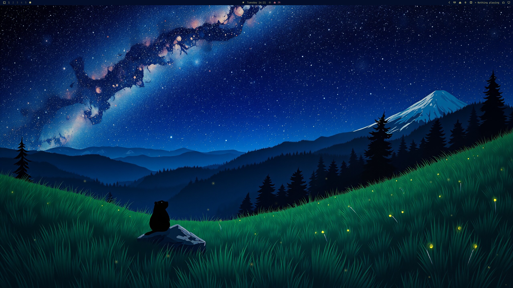
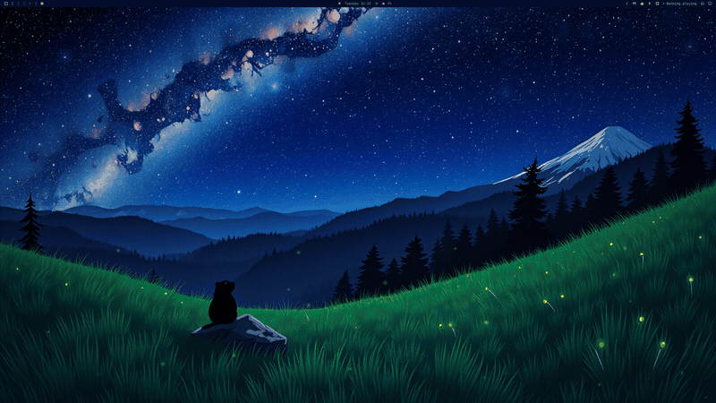
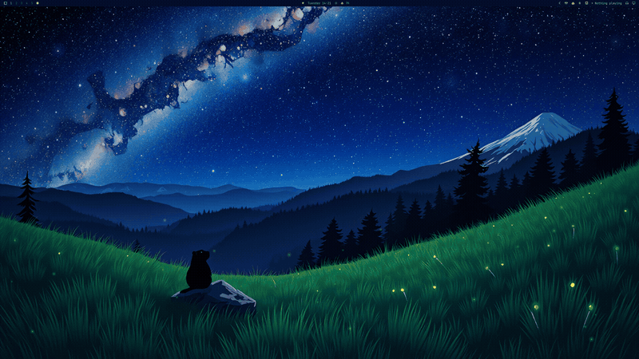
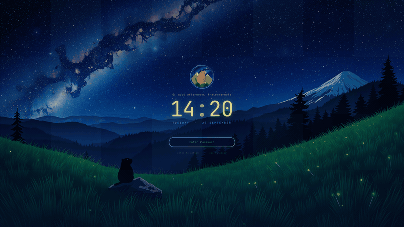
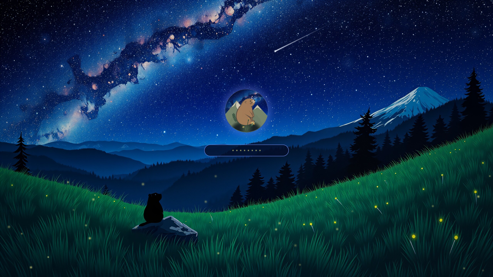
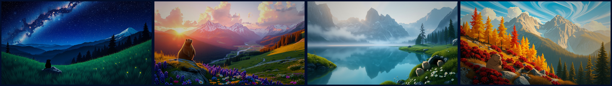

# Alpine Marmot · Starwatch

A night-meadow theme for [Omarchy](https://omarchy.org): a marmot watching the Milky Way, fireflies drifting through the grass. It includes more than colors and a wallpaper. The sky moves, and the lock screen, login intro and boot splash all match.



| Live wallpaper | Login intro | Lock screen |
|---|---|---|
|  |  |  |

**Boot splash** (LUKS password prompt):



**Wallpapers**: Starwatch (animated), Meadow Sunset, Burrow Dawn, Larch Autumn:



## What's inside

| Piece | What it does |
|---|---|
| **Theme** (`colors.toml`, `backgrounds/`, `btop.theme`, `icons.theme`) | The "Starwatch" palette: navy sky, blue accent, firefly-cream text. The palette was pulled from the wallpaper with Aether and the reds/yellows were hand-tuned. Includes 4 wallpapers. |
| **Live wallpaper** (`plugins/fratermarmota.background`) | A GPU shader over the Starwatch wallpaper. Stars twinkle, fireflies drift and pulse in the grass, and a shooting star crosses now and then. Runs at 30 fps and pauses when a window is fullscreen. Other wallpapers stay static. |
| **Lock screen** (`plugins/fratermarmota.lock`) | Animated sky with a slow zoom, the marmot badge in a rotating ring, a greeting, a glowing clock, and a password pill with an aurora ring. Fireflies float around and every keystroke throws sparks. Wrong passwords shake red. |
| **Login intro** (`plugins/fratermarmota.intro`) | A ~5 s overlay once per boot. The sky fades in, fireflies gather into the badge, then an iris opens onto your desktop. It's click-through, so it never blocks you. |
| **Boot splash** (`plymouth-starwatch/`) | Animated Plymouth theme with twinkling stars, drifting fireflies, a shooting star and a floating badge. Password bullets are drawn as fireflies. Optional, and needs sudo. |
| **Login chime** (`sounds/`) | A soft synthesized night-meadow chime played at login. Optional. |
| **Terminal rice** (`extras/`) | Starship prompt, fastfetch marmot logo, lazygit, eza and fzf colors, and a transparent btop. Optional. |

## Install

Requires an up-to-date Omarchy (the Quickshell-based `omarchy-shell`).

```bash
git clone https://github.com/prostratepossum/omarchy-alpine-marmot-theme.git
cd omarchy-alpine-marmot-theme
./install.sh            # theme + live wallpaper + lock screen + intro
./install.sh --all      # ...plus terminal rice and login chime
```

Other options: `--dotfiles`, `--sound`, `--no-plugins` (theme only). Any file the installer replaces is backed up next to the original as `*.bak.<timestamp>`.

**Just the colors and wallpapers?** Use `omarchy theme install https://github.com/prostratepossum/omarchy-alpine-marmot-theme.git`.

**Boot splash (optional):**

```bash
~/.config/omarchy/themes/alpine-marmot/plymouth-starwatch/install.sh           # install
~/.config/omarchy/themes/alpine-marmot/plymouth-starwatch/install.sh --revert  # back to stock
```

This rebuilds your initramfs. If the splash ever misbehaves, press **Esc** at boot for the plain text password prompt, then run `--revert`.

## Try it out

```bash
omarchy-shell -q intro play                  # replay the login intro
omarchy-shell lock previewInteractive        # preview the lock screen without locking (closes after 90 s)
omarchy-shell -q background toggleAnimation  # pause/resume the live wallpaper
```

The live wallpaper costs about 8 W of GPU power and ~2% GPU busy on a Radeon RX 9070 XT. Turn it off with the toggle above if you're on battery.

## Uninstall

```bash
./install.sh --uninstall      # restores the stock Omarchy background + lock plugins
omarchy theme set <another-theme>
```

## Notes

- The keyboard lighting script in `extras/keyboard/` targets a Razer BlackWidow through OpenRGB. It's included as a reference and is not installed automatically.
- Shaders ship precompiled (`.qsb`). After editing `starwatch.frag`, rebuild with
  `/usr/lib/qt6/bin/qsb --glsl "100es,120,150" --hlsl 50 --msl 12 -o starwatch.frag.qsb starwatch.frag`.
- The background and lock plugins are forks of Omarchy's built-in `omarchy.background` and `omarchy.lock` (MIT).

## License

Code: MIT (see `LICENSE`). Artwork (wallpapers, badge, splash images, chime): free for personal use. Please don't resell it or use it in other products without asking.
