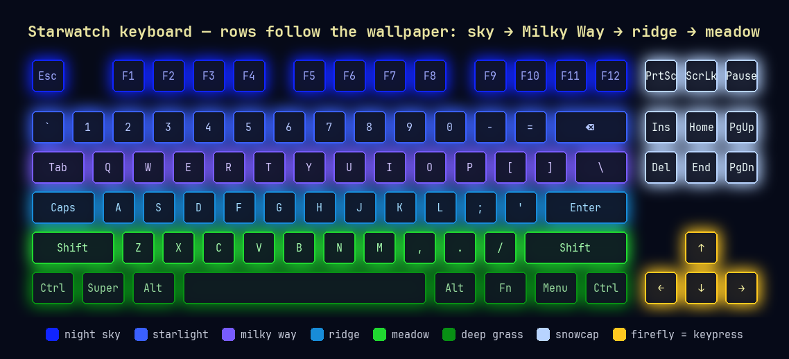

# Starwatch keyboard lighting

Per-key RGB that matches the Starwatch wallpaper. The board reads top to bottom like the picture: night sky on the F-row, starlight and the Milky Way above the home row, a blue ridgeline, then meadow green. The arrows glow as fireflies, the nav cluster is the snowy peak, and every keypress flashes firefly yellow and fades back.



*Colour map rendered from the script's own palette. On the real LEDs the sky rows read as deep night blue.*

## Hardware

Written for a **Razer BlackWidow V4 Low Profile TKL** (wired or HyperSpeed wireless) through [OpenRGB](https://openrgb.org). Other keyboards need changes: set `DEVICE_MATCH` to your keyboard's name as OpenRGB lists it, adjust `MATRIX_LEDS` to its LED matrix, and change the `"blackwidow"` match in `find_keyboard_devices()`. The colours and row logic at the top of the file carry over as they are.

## Setup

```bash
sudo pacman -S openrgb python-evdev
sudo usermod -aG input $USER          # for the keypress flash; log out and back in

install -Dm755 keyboard-lights ~/.local/bin/keyboard-lights
keyboard-lights --once                # set the colours once and exit (no input access needed)

install -Dm644 keyboard-lights.service ~/.config/systemd/user/keyboard-lights.service
systemctl --user daemon-reload
systemctl --user enable --now keyboard-lights.service
```

The service starts its own OpenRGB server on port 6743 if one isn't running.

## Privacy

For the keypress flash, the daemon reads key events from the keyboard's input device. It only uses which key went down to pick the LED to flash. Nothing is stored, logged, or sent anywhere. The `input` group gives any program you run that same access, so use `--once` instead of the service if you'd rather not join it.

## Remove

```bash
systemctl --user disable --now keyboard-lights.service
rm ~/.config/systemd/user/keyboard-lights.service ~/.local/bin/keyboard-lights
```

Your keyboard keeps the last colours until you set new ones in OpenRGB or Razer's tools.
